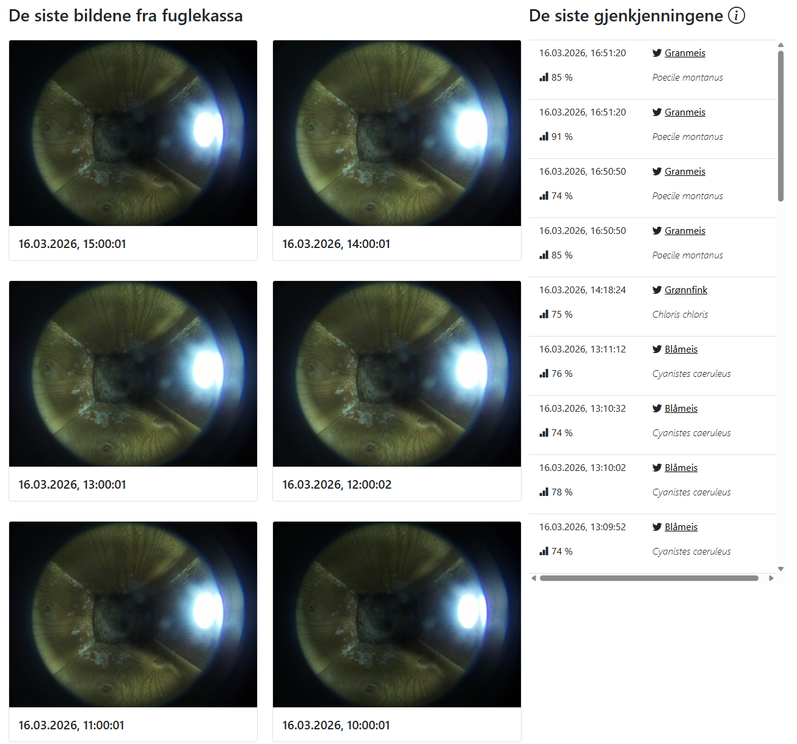

# BudorBeach
Har lekt meg med å installere fuglekasse med kamera på hytta. Kom også tilfeldigvis over prosjektet BirdNET: https://github.com/birdnet-team/BirdNET-Analyzer og ble dermed installert til å installere en mikrofon og implementere fuglesang-overvåking. Absolutt et hobbyprosjekt, så forvent for all del ikke at alt fungerer feilfritt. 
Oppkalt etter badeplassen satt opp i nærmeste myr ved hytta, Budor Beach.

BudorBeach-repoet i korte trekk: 
- `budorWeb` er en Razor Pages-nettside hostet på [budorbeach.no](https://budorbeach.no). For å vise siste bilder tatt fra fuglekassa, og se og høre siste fuglesang-gjenkjenninger. Har også satt opp toveis-kommunikasjon med Raspberry Pi-en i fuglekassa gjennom SignalR for å live-fjernstyre kameraet, og for å sende live-sensordata. 
- `rpiDaemon` er .NET-servicen som kjører på Raspberry pi-en via Docker. Den orkestrerer alt av datainnsamling: sensoravlesning, bildetaking, lydopptak, analyse av lydfiler++. Bruker Quartz.NET for å kjøre jobber periodisk, og har satt opp SQL Server for persistering. 
- `birdNetServer` er et lite Python-api som internt kjører BirdNET-Analyzer. Eksponerer enkle endepunkt som kalles av rpiDaemon i Docker. 

